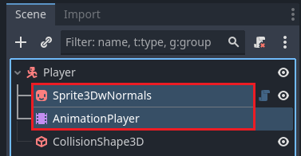
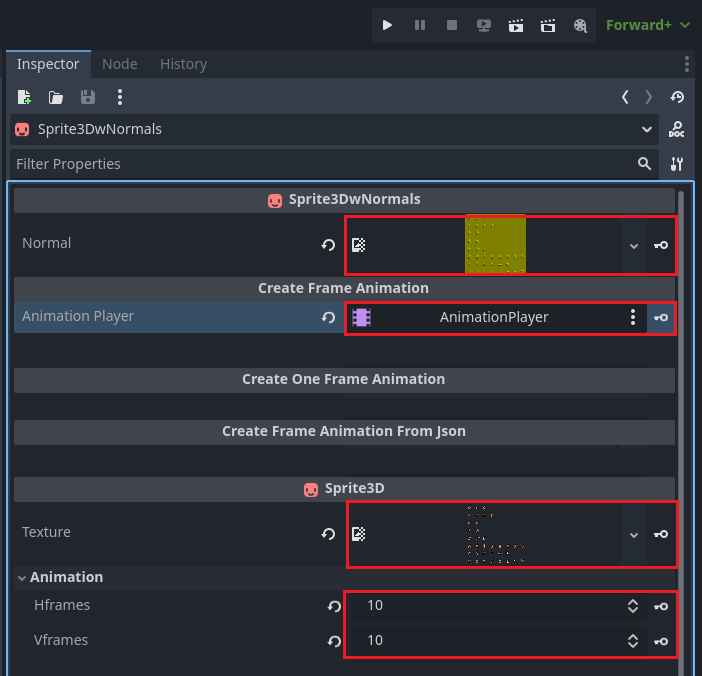

# Normal Maps for Sprite3D Plugin

A Godot4 plugin that helps with creating a Sprite3D with normal maps and animations

## How to Use

### Prepare Sprite Sheet and Normal Map

Prepare  a full-action sprite sheet (`.png` format recommended) containing all frames for all animations, ensuring each action occupies a single horizontal row.

Generate a corresponding normal map for this sprite sheet, typically using a tool like `Laigter`.

> Due to copyright restrictions, no sample sprite sheet or normal map is provided here.

### Import Textures

Ensure both the sprite sheet and normal map are placed in your Godot 4 project folder.

### Enable the Plugin

In `Project` → `Project Settings` → `Plugins`, enable the `Normal Maps for Sprite3D` plugin.

### Set Up the NormalMapsForSprite3D Node

Add a `NormalMapsForSprite3D` node and an `AnimationPlayer` node to your scene.

#### Configure Texture Properties

In the Inspector panel, configure the `NormalMapsForSprite3D` node properties:

- `Normal` : Select the normal map texture.
- `AnimationPlayer` : Select the `AnimationPlayer` node for animation creation.
- `Texture` : Select the sprite sheet texture.
- `Hframes` : Set the number of horizontal frames in the sprite sheet.
- `Vframes` : Set the number of vertical frames in the sprite sheet.

#### Create Animations

You can create animations for the `NormalMapsForSprite3D` node using two methods:

> Check the `Delete Existing Animations Before Creating` checkbox to remove existing animations before creating new ones. This is useful when you want to retry with different settings.

1. **Create a Single Animation**
   Use the properties in the Inspector and click the `Create Animation` button:

   - `Animation Name` : Set the animation name.
   - `Animation Col` : Select the starting column index (beginning at 1) of the animation's first frame.
   - `Animation Row` : Select the starting row index (beginning at 1) of the animation's first frame.
   - `Frame Number` : Set the total number of frames in the animation.
   - `Frame Duration` : Set the duration of each frame.
   - `Loop Mode` : Set whether the animation should loop.

2. **Create Multiple Animations**
   Use the `JSON Path` property in the Inspector and click the `Create Animation From JSON` button:

   - `JSON Path` : Set the path to a JSON file containing animation data, using the same configuration structure as method 1.

> The JSON file must be placed in your Godot 4 project folder. Refer to `example_animations.json` for a template.
